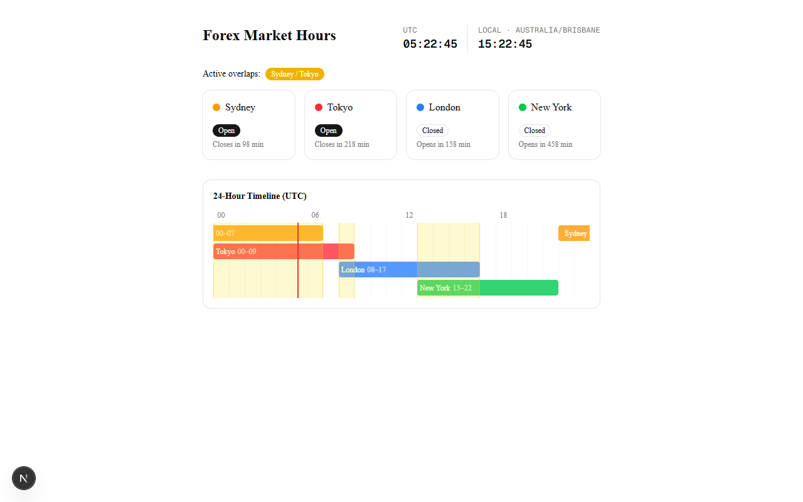

# Forex Market Hours Visualiser — SpecKit Workflow

A fully client-side single-page app that shows live open/closed status for the four major forex sessions, a 24-hour timeline with overlap zones, and a dual-timezone live clock — all computed from the device clock with no network requests.

Built with **Next.js 16 + Tailwind CSS v4** using **SpecKit** as the development workflow.

---



---

## Features

- **Live session status** — Sydney, Tokyo, London, New York open/closed cards with minutes-to-open/close
- **Overlap detection** — active overlap zones (e.g. Sydney/Tokyo, London/New York) highlighted in real time
- **24-hour UTC timeline** — CSS-grid timeline showing all sessions and overlap bands with a live position cursor
- **Dual-timezone clock** — UTC and local time updated every second
- **Fully offline** — zero network requests after initial load; works without a backend

## Tech Stack

| Layer | Choice |
|---|---|
| Framework | Next.js 16 (App Router) |
| Language | TypeScript 5 |
| Styling | Tailwind CSS v4 |
| Components | shadcn/ui (Badge, Card, Separator) |
| Testing | Vitest + jsdom |

## Project Structure

```
frontend/                          # Next.js app
├── src/
│   ├── app/
│   │   ├── layout.tsx
│   │   ├── page.tsx               # Server component; renders ForexHoursVisualiser
│   │   └── globals.css
│   ├── components/
│   │   └── forex-hours/
│   │       ├── ForexHoursVisualiser.tsx   # 'use client' boundary; owns clock state
│   │       ├── SessionCard.tsx            # Per-session open/closed card
│   │       ├── SessionTimeline.tsx        # 24-column CSS-grid timeline
│   │       ├── OverlapBadge.tsx           # Active overlap zone badge
│   │       └── LiveClock.tsx             # Dual-timezone HH:MM:SS display
│   ├── lib/
│   │   └── forex-sessions/
│   │       ├── sessions.ts               # Session + overlap constants
│   │       ├── session-status.ts         # isSessionOpen, computeSessionStatuses
│   │       └── overlap-windows.ts        # computeActiveOverlaps
│   └── hooks/
│       └── useClock.ts                   # setInterval hook returning ClockState
specs/
└── 001-forex-hours-visualiser/
    ├── spec.md
    ├── plan.md
    ├── research.md
    ├── data-model.md
    └── contracts/ui-contracts.md
```

## Getting Started

```bash
cd frontend
npm install
npm run dev
```

Open [http://localhost:3000](http://localhost:3000).

## Running Tests

```bash
cd frontend
npm test
```

## Workflow: SpecKit

**Constitution → Spec dialogue → Frozen spec → Implementation plan → Tasks → Analysis → Code → Tests pass.**

SpecKit encodes requirements once in `.specify/memory/constitution.md` and propagates them automatically into every downstream artifact. Requirements stated in the constitution cannot be silently dropped — they surface in the spec, plan, and task list.

### Command Sequence

**1. Establish principles**

```
/speckit.constitution Create principles focused on code quality, testing standards, user experience consistency, and performance requirements
```

Define non-negotiable engineering principles before any feature work begins. For this project the four pillars are code quality, testing standards, UX consistency, and performance requirements. These become gates that every implementation plan must pass.

**2. Write the spec**

```
/speckit.specify I want to build a Forex Market Hours visualiser that shows which of the four
major forex trading sessions (Sydney, Tokyo, London, New York) are currently open, with visual
overlap indicators and a live clock. No server-side data fetching. No trading volume display.
```

SpecKit runs a dialogue to clarify scope, constraints, and acceptance criteria, then freezes the spec as `specs/<id>/spec.md`. The frozen spec is the single source of truth — it cannot be silently changed later.

**3. Generate the implementation plan**

```
/speckit.plan The application uses Next.js App Router, TypeScript, Tailwind CSS, shadcn/ui and Vitest.
```

Produces `specs/<id>/plan.md` with a constitution check gate table, technical context, and project structure. The plan re-checks all four constitution principles before proceeding.

**4. Break work into tasks**

```
/speckit.tasks
```

Decomposes the plan into an ordered, dependency-aware task list at `specs/<id>/tasks.md`. Each task maps to a single deliverable and references the relevant spec requirement.

**5. Analyse and validate**

```
/speckit.analyse
```

Runs static analysis over the generated tasks — checks for missing coverage, constitution violations, and dependency ordering issues. Re-run until the analysis reports no blockers.

**6. Implement end-to-end**

```
/speckit.implement
```

Execute `tasks.md` end-to-end with high autonomy:

- Accept all non-destructive edits automatically
- Make reasonable assumptions based on the existing codebase and spec
- Only pause for: missing secrets/credentials · destructive or irreversible actions · ambiguous requirements that cannot be resolved reasonably · external dependencies or approvals that cannot be obtained
- After implementation, summarise changes, assumptions, and verification steps

---

Spec and plan for this feature: [`specs/001-forex-hours-visualiser/`](specs/001-forex-hours-visualiser/)

> **Note:** `.specify/` and `.claude/` are gitignored — they contain the SpecKit harness and Claude Code skills installed locally. To use the `/speckit.*` workflow commands, install SpecKit from [github.com/github/spec-kit](https://github.com/github/spec-kit) and run the init command in the repo root.

## See Also

**[forex-market-zones-superpowers](https://github.com/peterpuglisi/forex-market-zones-superpowers)** — the same Forex Market Hours Visualiser built with the Superpowers workflow. Useful as a side-by-side comparison of how the two approaches handle spec, planning, and implementation for an identical feature brief.
